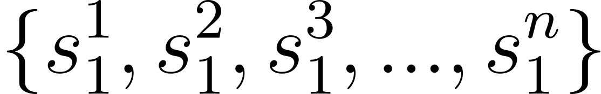
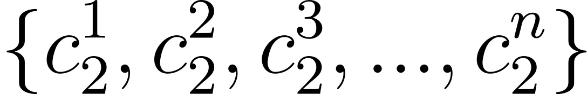
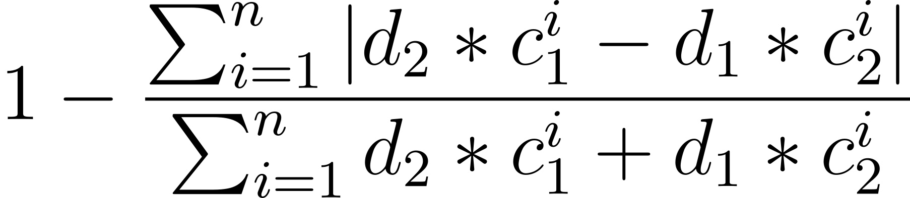

# GenomeCompareLCP

## Overview

**GenomeCompareLCP** is a cutting-edge tool designed for the comparison of genomic sequences. 
Unlike traditional genomic comparison methods that rely on hashing techniques, GenomeCompareLCP utilizes Locally Consistent Parsing (LCP), a novel approach that processes strings recursively to identify cores adhering to the LCP rules. 
This method enables highly accurate comparisons between given genomes, specifically catering to `.fastq.gz` compressed files containing long reads.

## Features

- *Locally Consistent Parsing (LCP)*: Employs LCP for deep and accurate genome comparison.

- *Efficiency*: Designed to handle `.fastq.gz` compressed files directly, saving time and disk space.

- *Multi-threading Support*: Capable of utilizing multiple threads for processing, significantly speeding up the comparison process.

## Getting Started

### Prerequisites

- A modern C++ compiler (e.g., g++ or clang++) capable of C++11 or later.

- GNU Make for building the program.

- Access to a Unix-like environment (Linux, macOS).

### Installation

1) Download the source code to your local machine.
  
2) Extract the files (if compressed) and navigate to the project directory.

3) Navigate to `lcptools/program`.
    
4) Run `make compile` in the terminal within the project directory. This compiles the source code and generates an executable named `compare-genomes`.

### Installation on Unix (Linux & macOS)

First, open your terminal. 
Then execute the following commands to clone the repository and compile the source code:

```cpp
# clone the repository
git clone https://github.com/akmami/lcptools.git

# navigate to the project directory
cd lcptools/program

# create necessary directories
make

# compile the source code using Makefile
make compile

# optionally, move the executable to a directory in your PATH for global access
sudo cp ../bin/compare-genomes /usr/local/bin

# optionally, you can test the program
make test
```

These instructions assume that you have `git`, a C++ compiler, and `make` installed on your system. 

The `sudo mv compare-genomes /usr/local/bin` command is optional and requires administrative privileges. 
It makes the `compare-genomes` executable globally accessible from any terminal window.


### Running `compare-genomes`

`compare-genomes` efficiently compares two genomes from compressed `fastq.gz` files utilizing the Locally Consistent Parsing (LCP) approach. The program is designed to optimize performance through multi-threading.

### Usage

Execute `compare-genomes` with the following command structure:

```cpp
./compare-genomes genome-input-1.fastq.gz genome-input-2.fastq.gz --lcp-level <lcp_level> -t <threads_per_genome> --genome-1-len <length_of_genome_1> --genome-2-len <length_of_genome_2>
```
Parameters

* `genome-input-1.gz`: Path to the first compressed FASTQ file.
* `genome-input-2.gz`: Path to the second compressed FASTQ file.
* `-l <lcp_level>`: Sets the LCP level for the analysis. 
Replace <lcp_level> with the desired level. 
It is advised to set it to *7*.
* `-t <threads_per_genome>` *(optional)*: Indicates the number of threads allocated for processing each genome. Default is set to *8*.
This count includes threads for reading and processing tasks. 
Since the program analyzes two genomes simultaneously, the total number of threads used is double the number specified here plus two for the reader threads, leading to a total of *10* threads for *4* processing threads per genome if `-t` is given as *4*.
* `--genome-1-len <length_of_genome_1>`: The length of the first genome in bases.
* `--genome-2-len <length_of_genome_2>`: The length of the second genome in bases.

### Example

To run a comparison between two genomes, specifying their lengths and using an optimal number of threads for processing:

```cpp
./compare-genomes genome1.fastq.gz genome2.fastq.gz -l 7 -t 4 --genome-1-len 3088269832 --genome-2-len 3088269832
```

This command compares genome1.fastq.gz and genome2.fastq.gz, applying an LCP level of *7* and allocating *4* threads for the processing of each genome. Considering the architecture of the program, this setup results in using *1* thread for reading and *4* threads for processing per genome, totaling *10* threads for the analysis of two genomes.

## Input Files

GenomeCompareLCP requires fastq files as input, which should contain the long reads of the genomes to be compared.

- `Fastq Format`: Each input file must comply with the standard fastq format.

## Program Outputs

After successfully running `compare-genomes`, the program generates several outputs, including logs and similarity metrics. 
Below are the key results you can expect, along with brief explanations of each metric:

### Similarity Metrics

* `Jaccard Similarity`: This metric measures the similarity between the two genomes based on the intersection over the union of their features. A value closer to 1 indicates higher similarity. 

* `Dice Similarity`: Similar to the Jaccard Similarity, the Dice Similarity measures the overlap between two genomes but considers the size of the two sets in its calculation, leading to a more sensitive measure in certain contexts.

* `Distance Based Similarity`: This metric evaluates the similarity based on a distance function, with a value closer to 1 indicating minimal distance or high similarity between the genomes. It also include normalization of the given genomes having different read depths.

#### Distance Based Similarity

The Distance Based Similarity between two genomic sequences, `G1` and `G2`, is determined through a formula that considers the occurrences of each LCP core within the genomes and their sequencing depths. 
This approach aims to offer a detailed perspective on similarity, factoring in not only the presence of cores but also their abundance in relation to sequencing depth.

#### Formula Breakdown

Given two genomic sequences, `G1` and `G2`:

* `G1` =  denotes the set of cores in the first genome.
* `counts1` =  corresponds to the number of occurrences of each core in `G1`.
* `G2` =  denotes the set of cores in the second genome.
* `counts2` =  corresponds to the number of occurrences of each core in `G2`.
* `d1` and `d2` represent the sequencing depths of genomes `G1` and `G2`, respectively.

The similarity between `G1` and `G2` is calculated using the following formula:

Similarity: 

#### Interpretation

This formula calculates the similarity by evaluating the absolute difference in the weighted occurrences of each core between the two genomes, normalized by the sum of these occurrences and subtracting from *1*. 
The weights are assigned based on the sequencing depths of the genomes, allowing the similarity score to reflect variations in sequencing efforts accurately.

* A Similarity score close to 1 indicates a high degree of similarity, implying minimal differences in the adjusted occurrences of cores between the genomes.
* A score nearing 0 suggests greater disparity between the genomic sequences, as indicated by significant differences in the weighted core occurrences.

### Logs

The program also produces detailed logs during its execution. 
These logs can provide insights into the processing stages, any potential issues encountered, and additional statistical information about the comparison process. 
Users are encouraged to review the logs for a comprehensive understanding of the program's operation and results.

## Example Output

Upon completion, the program will display the similarity metrics in the terminal as:

```cpp
# Logs and genome related statistics

Jaccard Similarity: 0.728918
Dice Similarity: 0.843207
Distance Based Similarity: 0.9936
```

This output provides a concise summary of the comparative analysis between the two genomes, highlighting their similarities across different metrics.

## License

GenomeCompareLCP is released under BSD 3-Clause License.

For more details, please visit the [license file](https://github.com/akmami/lcptools/blob/main/LICENSE).